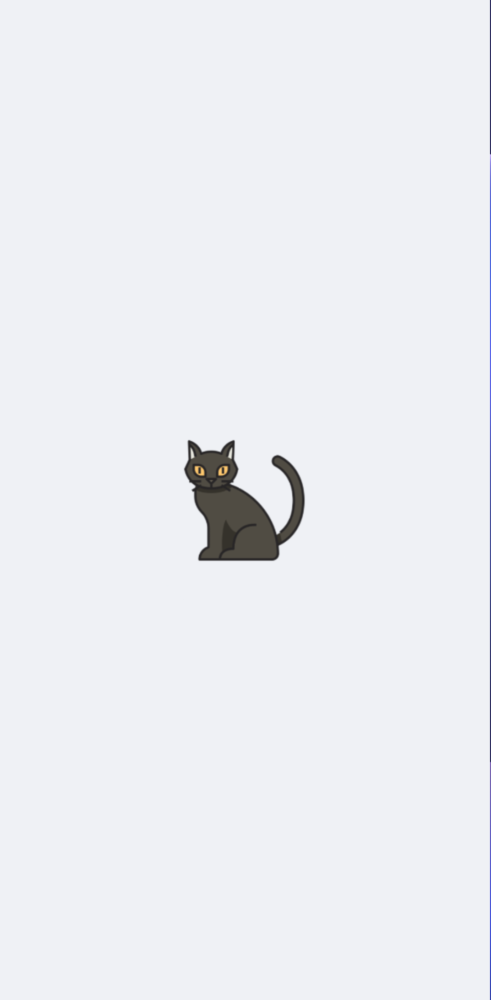
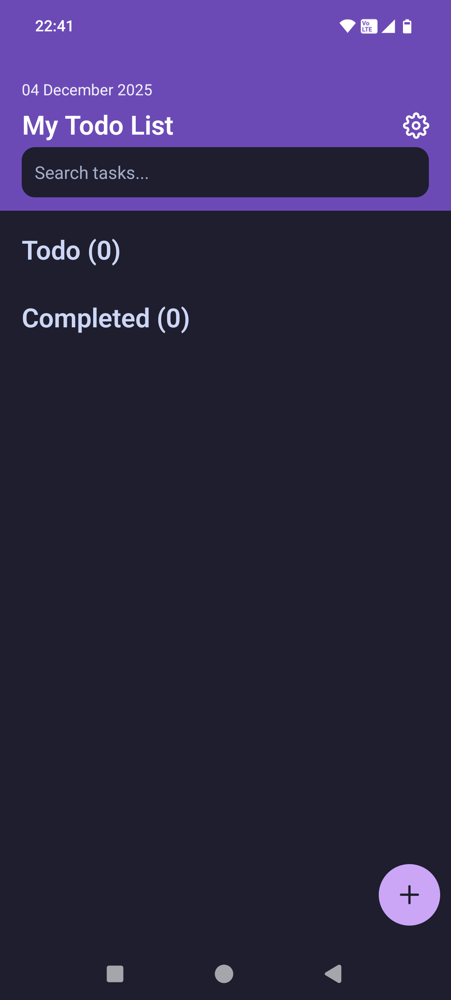
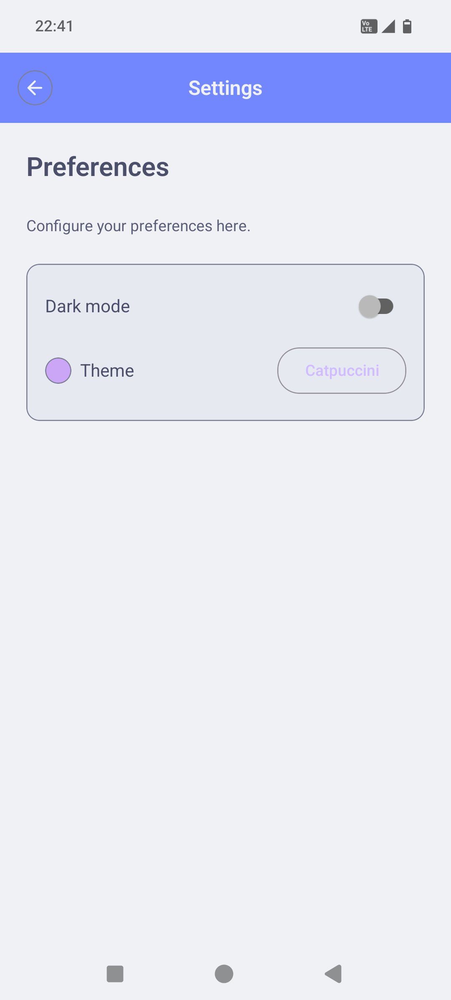
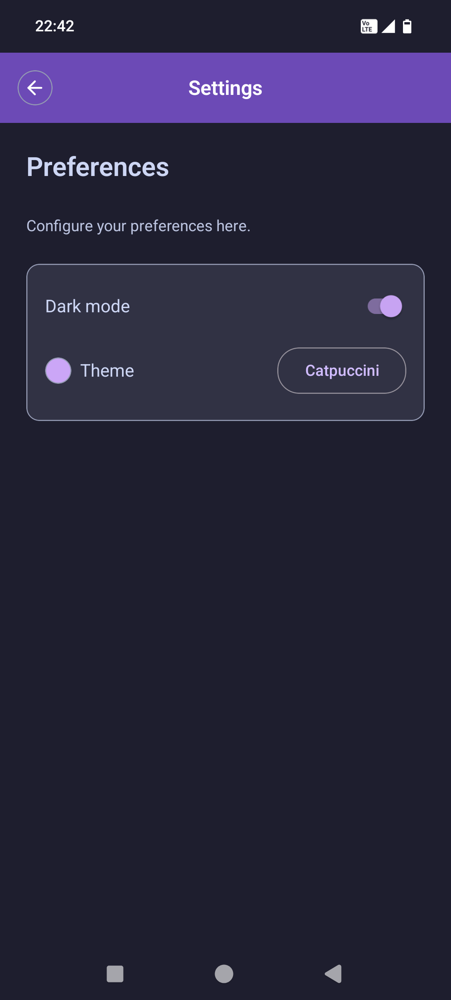
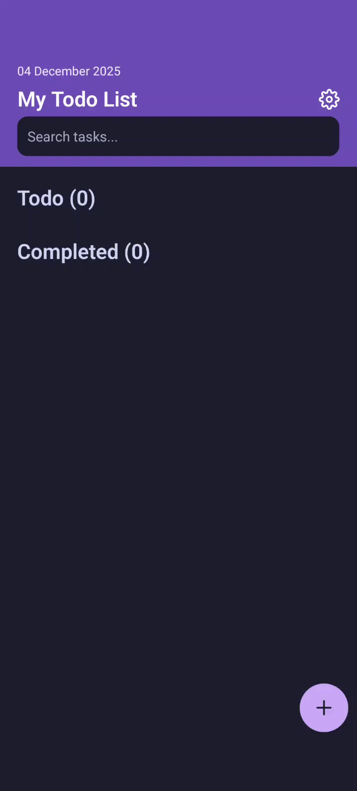
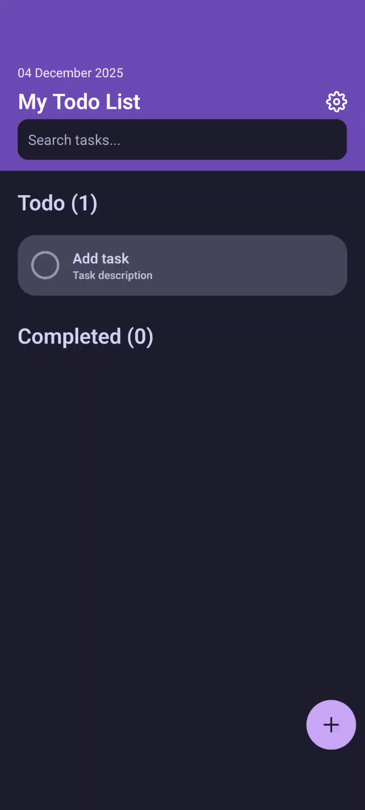
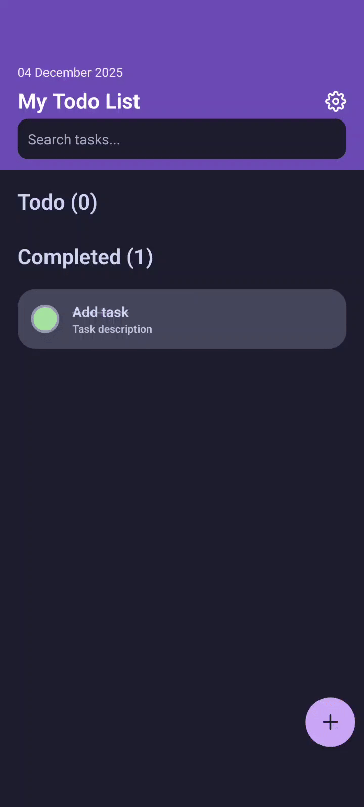
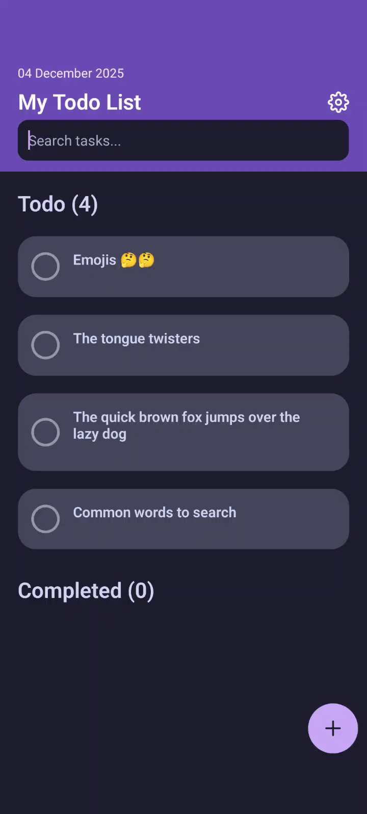

<h1 align="center">Tascaty</h1>
<h3 align="center">Simple, fast and styled task manager.</h3>

---

<div align="center">

</div>

---

# Tascaty - Task Management App

Tascaty is a modern, cross-platform mobile application built with React Native and Expo, designed to help you manage your tasks efficiently. With a clean and intuitive interface, Tascaty makes it easy to organize your daily activities, track progress, and stay productive.

## Tech Stack

- **Frontend**: React Native with TypeScript
- **Navigation**: Expo Router
- **State Management**: React Hooks
- **UI Components**: React Native Paper, @gorhom/bottom-sheet
- **Database**: SQLite with Drizzle ORM
- **Styling**: React Native Unistyles
- **Build Tool**: Expo

## Themes

- **Current**: Catpuccini theme (light/dark variants integrated across the app UI).
- **Future**: Supports adding more themes in the future.

### Splash screen
| Splash Light | Splash Dark |
| :----------: | :---------: |
|  |  |

### Home screen

| Home Screen Light | Home Screen Dark |
| :---------------: | :--------------: |
|  |  |

### Settings screen
| Settings Screen Light | Settings Screen Dark |
| :-------------------: | :------------------: |
|  |  |

## Preview:

### **Adding a task**:

<details>
<summary>Click to view video preview</summary>

</details>

### **Marking a task as completed**:

<details>
<summary>Click to view video preview</summary>

</details>

### **Deleting a task**:

<details>
<summary>Click to view video preview</summary>

</details>

### **Search a task**:

<details>
<summary>Click to view video preview</summary>

</details>

## Getting Started

### Prerequisites

- Node.js (v16 or later)
- npm or yarn
- Expo CLI (`npm install -g expo-cli`)
- iOS Simulator (for iOS development) or Android Studio (for Android development)

### Installation

1. Clone the repository:

   ```bash
   git clone https://github.com/agamyo168/tascaty.git
   cd tascaty
   ```

2. Install dependencies:

   ```bash
   npm install
   # or
   yarn install
   ```

3. Run the app:

   ```bash
   npx expo run:android
   ```

## Project Structure

```
src/
├── app/                 # Main app screens and navigation
├── components/          # Reusable UI components
│   ├── common/          # Common components
│   └── tasks/           # Task-related components
├── db/                  # Database configuration and models
├── hooks/               # Custom React hooks
└── style/               # Global styles and themes
```

## Third-party Libraries

- **@gorhom/bottom-sheet**: Interactive bottom sheets for task details
- **drizzle-orm**: Type-safe SQL query builder and ORM
- **react-native-paper**: Material Design components
- **react-native-reanimated**: Smooth animations
- **expo-sqlite**: SQLite database integration
- **react-native-gesture-handler**: Native gestures
- **react-native-safe-area-context**: Safe area handling
- **react-native-splash-screen**: Splash screen

## Download:

- [Android APK](https://drive.google.com/file/d/1sOW5GjUsfOjxiB5BvD69BdM_lj6M1vxA/view?usp=drivesdk)

## Acknowledgments

- Black-cat icon created by [BZZRINCANTATION](https://www.flaticon.com/free-icons/black-cat)
